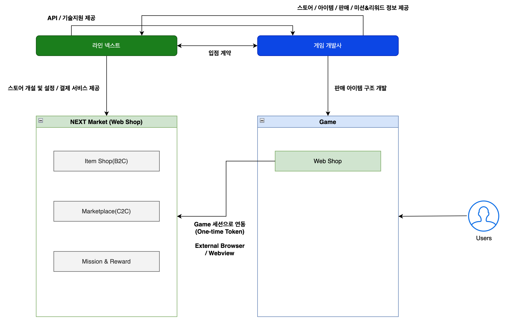

# Service Structure

## Diagram

<figure><figcaption></figcaption></figure>## Description

1. A contract between the game developer (or publisher) and LINE NEXT is required to list on NEXT Market (Item Web Shop).
2. LINE NEXT provides the API and technical support for integrating with NEXT Market.
3. The game developer (or publisher) provides the information necessary for configuring NEXT Market.
4. Users log into NEXT Market using their game authentication credentials.
5. Users can purchase items on NEXT Market using payment methods provided by LINE Next. Based on the purchase outcome, NEXT Market requests item delivery from the game developer.
