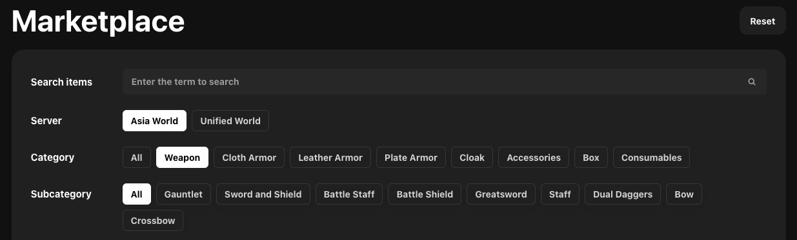
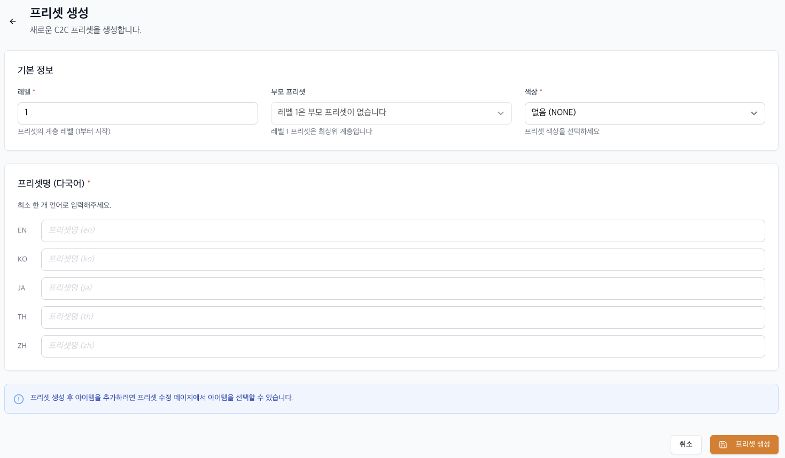
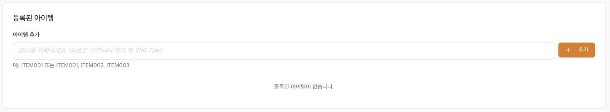
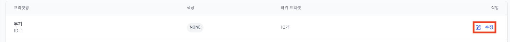

# C2Cプリセット管理

**C2Cプリセット管理ページは、C2Cアイテムに使用されるカテゴリ（アイテム分類階層構造）を登録・管理するページです。**\
C2Cアイテムのカテゴリ情報を事前に登録した後、C2C販売登録時に該当カテゴリを選択して使用できます。\
カテゴリ設定時はマーケットプレイスのフィルター領域に反映され、カテゴリ別にアイテムが表示されます。

<figure><figcaption></figcaption></figure>## C2Cプリセット登録

C2Cアイテムのカテゴリー設定は最大2階層まで設定可能です。

* レベル1: 親プリセット
* レベル2: 子プリセット



### C2Cプリセット管理ページの選択

* NEXT Market Consoleにアクセス
* 左メニューから**C2Cプリセット管理**ページを選択



### プリセット作成を選択

* プリセット作成ボタンを選択し、登録画面に移動します。

<figure><figcaption></figcaption></figure>



### 基本情報の入力

プリセット（カテゴリ）の基本情報を入力します。

| フィールド      | 値                                                                                                                                                                                                                                 |
| ---------- | ------------------------------------------------------------------------------------------------------------------------------------------------------------------------------------------------------------------------------------- |
| レベル         | <ul><li>
プリセットはレベル1～2まで設定可能
<ul><li>レベル1は最上位カテゴリであり、親プリセットを設定できません</li><li>レベル2はレベル1のサブカテゴリとして登録される</li></ul></li><li>
例)
<ul><li>レベル1: 武器</li><li>レベル2: 弓、大剣、杖、クロスボウ、短剣</li></ul></li></ul>                       |
| 親プリセット     | <ul><li>
レベル2プリセット登録時、親プリセット（レベル1）の設定が必要
<ul><li>レベル1プリセットは親プリセット設定不可</li></ul></li><li>
例)
<ul><li>プリセット: 弓</li><li>親プリセット: 武器</li></ul></li></ul>                                                               |
| 色         | <ul><li>カテゴリに表示される色を設定</li><li>設定可能な色: 青、黄、赤、緑</li><li>なしを選択するとデフォルト色が適用</li></ul>
⚠️ 色設定はグレード（レア度）カテゴリのみに登録することを推奨します。
<ul><li>
例） 
<ul><li>伝説: 黄色</li><li>レア：青</li><li>上級：緑色</li></ul></li></ul> |
| プリセット名 (多言語) | <ul><li>多言語入力サポート: en, ko, ja, th, zh</li><li>
取引所内のアイテム詳細画面に表示される値
<ul><li>マーケットで提供される言語については必ず登録が必要</li></ul></li></ul>                                                                                                    |

<figure><figcaption></figcaption></figure>


### アイテム登録

プリセットに含まれるアイテム（SKU）の設定は、プリセット初回登録時ではなく、登録完了後の修正機能を通じて登録可能です。

<figure><figcaption></figcaption></figure>


## C2Cプリセットの修正

**既に登録されたプリセットの情報は修正可能です。**

* **NEXT Market Console** にアクセス
* 左メニューから **C2Cプリセット管理** ページを選択
* プリセットリストから修正するプリセットを選択
* **修正する** ボタンをクリック
* プリセット情報を変更後、保存

<figure><figcaption></figcaption></figure>### ⚠️  修正時の注意事項

* プリセット登録はLINE NEXTと事前協議の上、進めてください。
* プリセットのレベル修正はできません。レベル変更が必要な場合は新しいプリセットを登録する必要があります。
* 既に運用中のプリセットの情報変更は、サービス運営に影響を与える可能性があります。
