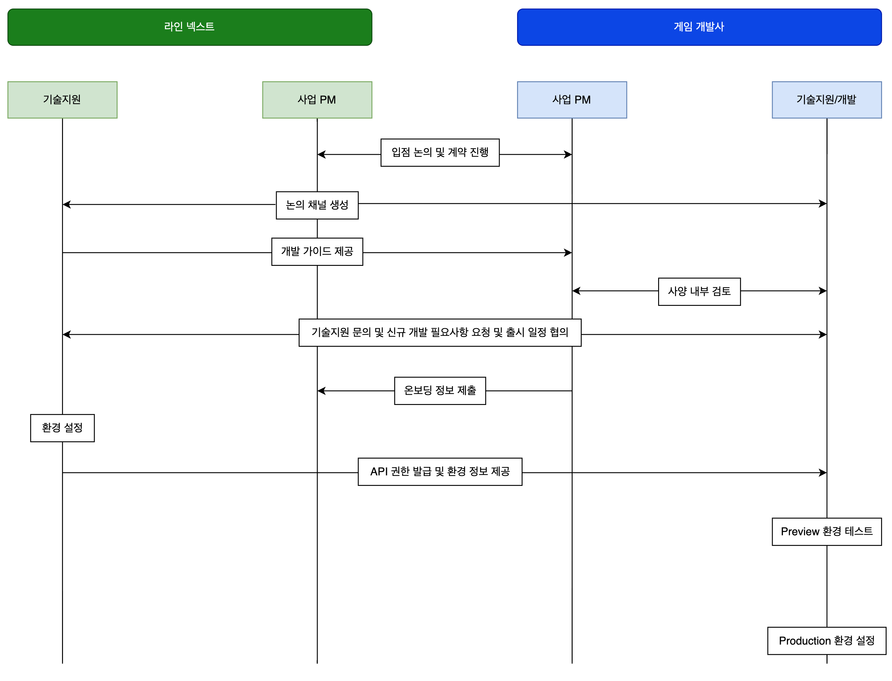

metaLinks:
  alternates:
    - &gt;-
      https://app.gitbook.com/s/pt4moEMpSf4BGvjJCzQm/next-market/onboarding-process
---

# オンボーディングプロセス

### 図解

<figure><figcaption></figcaption></figure>### 説明

1. LINE NEXTとゲーム開発会社（またはパブリッシャー）がNEXT Marketへの出店に関する協議と契約を進めます。
2. 迅速な連携のために、NEXT Marketとゲーム開発会社（またはパブリッシャー）間のコミュニケーションホットラインチャネルが作成されます。
3. NEXT Market連携のための技術仕様を共有し、ゲーム開発会社（またはパブリッシャー）はこれについて検討を進めます。
4. 技術サポートや新規仕様に関する開発支援が必要な場合、両社はミーティングを通じて協議できます。
5. ゲーム開発会社（またはパブリッシャー）はNEXT Market登録に必要な情報を提出します。
6. NEXT Marketでは提供された情報を基に環境及びストアを設定します。
7. ゲーム開発会社（またはパブリッシャー）は連携に必要なAPI権限を提供され、開発を進めます。
